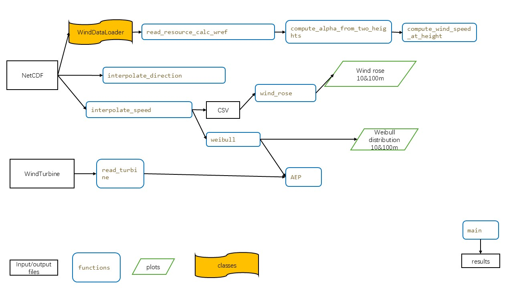

# Notes for the readme

The .nc files are wind ressource
The .csv files are specific wind turbines

# Our Great Package

The core functionality of this project is organized in the `assessment` Python package located in `src/assessment/`.

## Overview of package*

This package provides a set of tools for wind data reading, analysis, and visualization — specifically designed for wind energy applications such as wind resource assessment and wind farm planning.

### Modules included

`__init__`
Is the defalt file that the package should have.

---

`defclasses`
Here we defined a class for loading wind data. It includes file path, open the files, and turn them into dataframe as a preperation to calculate later.

---

`read_input`
Functions for reading NetCDF and wind turbine CSV input data, including calculations of the reference wind speed (the combination of 'u' and 'v', and reference wind directions)

---

`interpolate_4_loc`
In this module we have three functions, which are 
- `interpolate speed`: Interpolate the wind speed at a specific point inside the boundary box.
- `interpolate direction`: Interpolate the wind direction at a specific point inside the boundary box.
- `compute alpha`: Compute each alpha at time series by 10m and 100m.
- `compute apeed at height`: Calculate wind speed at a specific height using power law, taking 10m or 100m as the reference height.

---

`weibull`
In this module we fit Weibull distribution for wind speed at a given location (inside the box) and a given height.
Then plot the wind speed distribution (histogram vs. fitted Weibull distribution) at a given location (inside the box) and a given height.

---

`wind_rose`: Plot wind rose diagram that showes the frequencies of different wind direction at a given location (inside the box) and a given height.

---

`AEP`: Compute AEP of a specifed wind turbine (NREL 5 MW or NREL 15 MW) at a given location inside the box for a given year in the period we have provided the wind data

#### Extra

`open_nc_files`:
    Opens the .nc files since these files cannot be opened. It was used to know what columns to consider when calculating. 
`interpolate_4_loc` > `interpolate_max_ws_100()`:
    Interpolates the first wind speed value at 100m, but for multiple locations, defined as an array whith latitude and longitude between 55.5 - 55.75 and 7.75 - 8.
    The location is 0.01 specific. 
    Returns the location and the max wind speed.
`aep.pu` > `plot_aep()`:
    Calculates the AEP for the whole time period, with an interval of 1 month.

## Quick-start guide (Installation instructions*)

Follow the instructions below to install and run the project

### Prerequisites

Before installing, ensure you have the following installed.
- Python 3.11 or higher

In Anaconda Prompt: (Remember to install in you environment)
- pip install xarray
- pip install scipy
- pip install windrose

### Clone the repository

git clone https://github.com/DTUWindEducation/final-project-letsgorepo.git

### Run the project

python `example/main.py`

## Code Architecture (include diagram)*

## Classes description*

### `WindDataLoader` Class

The `WindDataLoader` class is designed to load wind speed and direction data from NetCDF files and compute reference wind values at multiple heights (10m and 100m). It provides a structured way to extract, process, and format wind data into a pandas DataFrame for further analysis.

### Key Features

- **Data Loading**: Opens and loads NetCDF files using `xarray`.
- **Wind Speed and Direction Calculation**: Computes wind speed and meteorological wind direction at 10m and 100m based on `u`/`v` components.
- **Data Conversion**: Converts the dataset into a long-form pandas DataFrame, ready for analysis or visualization.

### Methods

#### `__init__(self, file_path)`
Initializes the loader with the path to a NetCDF file.

#### `load_data(self)`
Loads the NetCDF dataset using `xarray` and returns it.

#### `compute_and_format_dataframe(self)`
Computes wind speed and direction at 10m and 100m, and returns a structured long-form DataFrame with relevant fields including:
- `ref_wind_speed`
- `ref_wind_direction`
- `latitude`, `longitude`
- `time`, `height`

## Git flow/ collaboration methodology*

First we cloned our team's repo. Then we worked on our own branches with different tasks, commited to our own branches from time to time. After we made our code work, at the time we need to use others outputs to continue working, we merged into main (with all agreements). Then repeated the process until finished.
